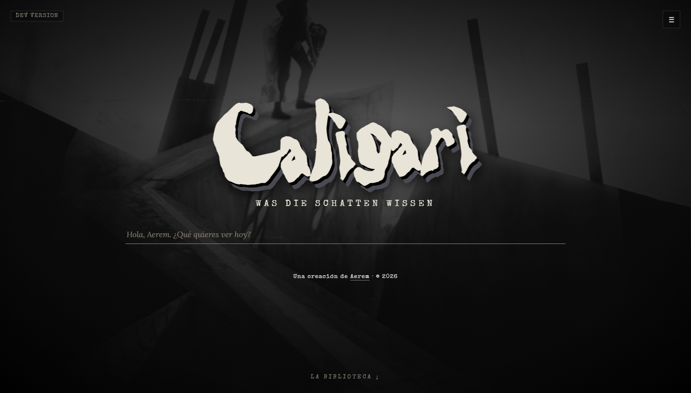

# 🎥 Caligari — IA local de cine (RAG + LLM)

Asistente conversacional **100% local** sobre teoría e historia del cine: un pipeline RAG propio sobre ~287 libros, con el foco puesto en que el modelo **no se invente** nada. Proyecto personal de aprendizaje en el que me centré en montarlo y, sobre todo, en **hacerle QA**.

**Stack:** Python · Ollama (Qwen2.5) · embeddings bge-m3 · ChromaDB · Flask

## Mi enfoque (QA + dirección)
- **Detección de fallos:** localicé las alucinaciones del modelo, el problema que motivó añadir validación de la salida.
- **Calidad sobre IA:** *grounding* + *guardrails* para acotar lo que el modelo puede inventar.
- **Pruebas en vivo** propias y documentación disciplinada (registro de decisiones, versionado).

Ante una pregunta de teoría, responde **citando los libros reales del corpus** y atribuyendo bien — anti-invención en acción:

## Más detalle
- 📐 [Cómo funciona el pipeline RAG](pipeline.md)
- ✅ [Extracto del checklist de pruebas en vivo (QA)](qa-checklist.md)

🔒 *Repositorio del código privado — acceso bajo petición.*

---
_Caligari · © 2026 Aerem · Todos los derechos reservados._
