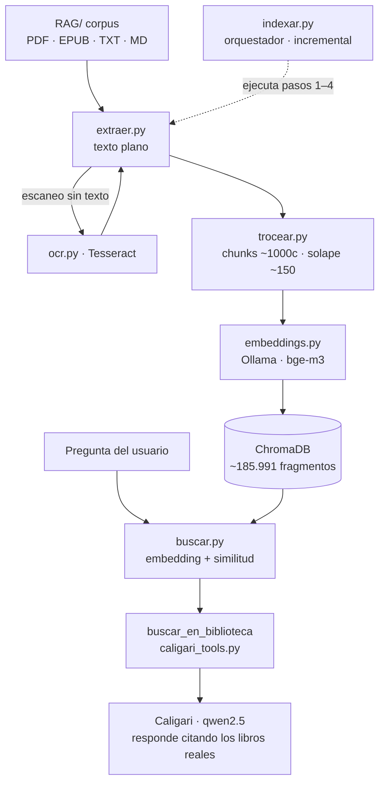

# Pipeline RAG de Caligari

El conocimiento de cine de Caligari se construye indexando un corpus de ~287 libros de teoría e historia del cine. Todo el proceso corre **en local** (el modelo de embeddings lo sirve Ollama).

## Indexado (construir la biblioteca)

`indexar.py` orquesta, por cada libro, cuatro pasos:

1. **`extraer.py`** — texto plano de cada fuente (PDF → `pdftotext`, EPUB → XHTML, TXT/MD directo). Lo escaneado sin texto se aparta para OCR (`ocr.py`, Tesseract).
2. **`trocear.py`** — *chunking*: fragmentos de ~1000 caracteres con ~150 de solape, cortando en límites naturales (párrafo > frase).
3. **`embeddings.py`** — cada fragmento se convierte en un vector con `bge-m3` (multilingüe: una pregunta en español encuentra texto en inglés).
4. **`indexar.py`** — guarda vectores y metadatos (libro de origen) en ChromaDB. Es **incremental**: solo procesa libros nuevos o modificados.

Resultado: ~185.991 fragmentos en `app/rag/chroma_db`.

## Consulta (responder en el chat)

La pregunta del usuario se convierte en vector (`buscar.py`), se recuperan de ChromaDB los fragmentos más parecidos junto con su libro de origen, y **Caligari** (qwen2.5) responde **citando solo los libros reales** que devuelve la biblioteca. Ese *grounding* es la defensa anti-invención del asistente.

## Diagrama

---

_Caligari · © 2026 Aerem · Todos los derechos reservados._
