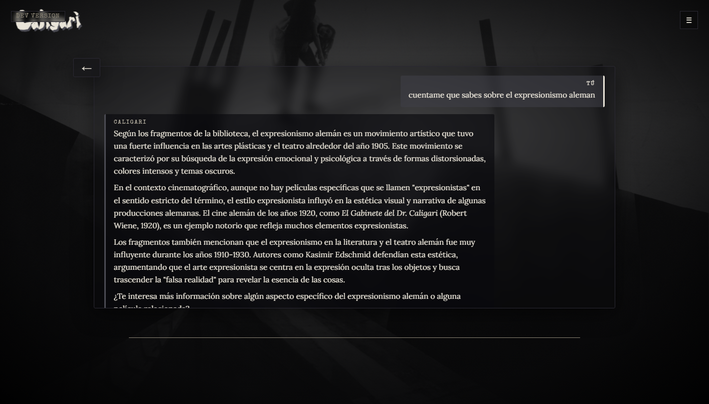
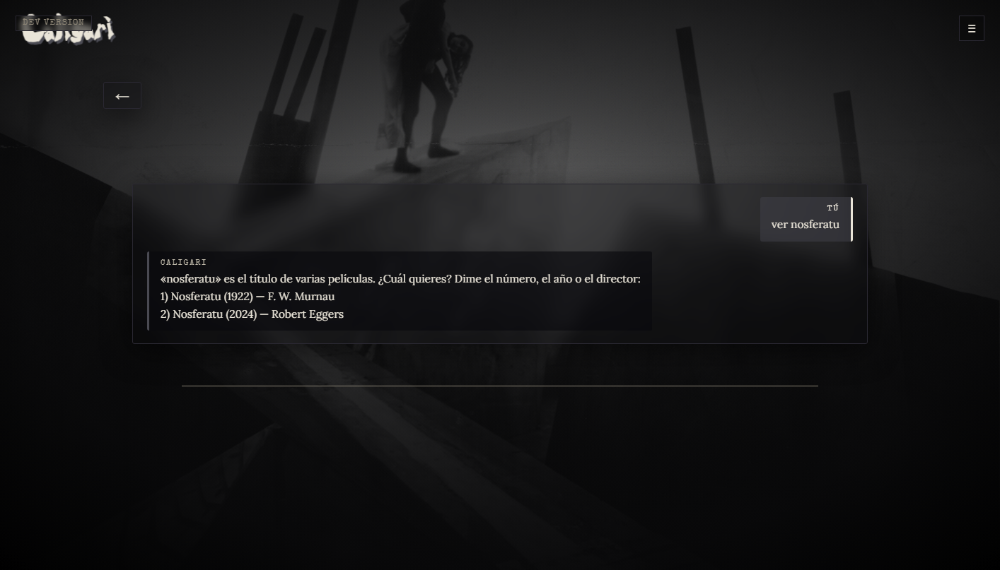

# Caligari — Pruebas en vivo (QA)

> Verificación en vivo del asistente de cine con IA: cada caso probado contra el build en ejecución y firmado. **Todo verificado** (corpus completo · 287/287 libros · 185.991 fragmentos).
> Extracto representativo — checklist completo disponible **bajo petición**.

## 🛡️ Calidad de la IA — anti-invención (guardrails + RAG)
Lo más crítico del proyecto: que el modelo **no se invente** libros, citas, autores ni datos. Validación de la salida contra el corpus real + *grounding* forzado vía RAG.

- [x] **Grounding forzado:** ante *"háblame del expresionismo alemán"*, cita **solo libros reales** del corpus (4 fuentes), con **0 obras inventadas** y atribución correcta (*El gabinete del Dr. Caligari* → Robert Wiene). Repetido con otro movimiento y un director.
- [x] **Sin pie falso:** cuando un dato no consta, responde *"no me consta"* en vez de improvisar (temperatura baja + *system prompt* de reglas versionado).
- [x] **Sin confusiones:** no mezcla obras de título parecido ni atribuye autores erróneos.
- [x] **Sin fugas internas:** en preguntas de teoría no nombra herramientas ni mecánica interna.

*Ejemplo real: responde "según los fragmentos de la biblioteca" y atribuye correctamente (El Gabinete del Dr. Caligari → Robert Wiene).*

## 🧭 Disciplina de proceso
- **Pendiente → verificado:** cada caso pasa de checklist a confirmado en vivo, con **fecha** y sign-off.
- **Conciencia del entorno:** algunas pruebas se aplazaron a propósito porque el indexado ocupaba la GPU; se documentó el motivo y se reprobaron al terminar (corpus 287/287).
- **Regresión:** al añadir una función nueva se comprueba que no rompe las existentes.
- **Bugs con causa raíz:** los fallos se registran con su causa (p. ej. *"el servidor descartaba campos de la respuesta → rompía una función dependiente; faltaba preservarlos"*).

## 💬 Comportamiento del chat
- [x] **Idioma consistente:** responde **siempre en español** aunque los libros del corpus estén en inglés (bge-m3 es multilingüe).
- [x] **Criterio propio diferenciado:** distingue cuándo da **su opinión** de cuándo **cita los libros**, sin mezclarlos.
- [x] **Coherencia del hilo:** mantiene el contexto de los turnos anteriores en la misma conversación.
- [x] **Mini-chat persistente:** una conversación abierta desde la ficha de una película se guarda **titulada con la peli** y se retoma desde el historial principal.
- [x] **Gestión de chats:** borrar y renombrar con el **modal propio** de la app (no el de Windows); Esc cancela, Enter acepta.
- [x] **Robustez de UI:** Markdown correcto · sin respuestas vacías (*"(silencio)"*, bug corregido) · continuación de respuestas cortadas · refrescar (F5) no pierde el hilo · feedback de *"pensando"* mientras el modelo tarda.

## ⌨️ Manejo de entrada del usuario
- [x] **Tolerancia a erratas:** una entrada mal escrita se interpreta y **se confirma antes de actuar**.
- [x] **Desambiguación:** cuando una consulta coincide con **varias opciones**, las lista (numeradas) y acepta la elección por número o por atributo (año, autor…).
- [x] **No-resolvible → no rompe:** si no puede interpretar con seguridad, **pide reescribir** en lugar de adivinar (se descartó la autocorrección silenciosa porque devolvía resultados equivocados).
- [x] **Normalización:** tolera mayúsculas/minúsculas, acentos y espacios de más sin fallar.
- [x] **Caracteres especiales:** símbolos, comillas, etc. no rompen el parseo ni la consulta.

*Entrada ambigua → opciones numeradas para elegir por número, año o director.*

---

_Extracto representativo. Checklist completo disponible bajo petición._
_Caligari · © 2026 Aerem · Todos los derechos reservados._
