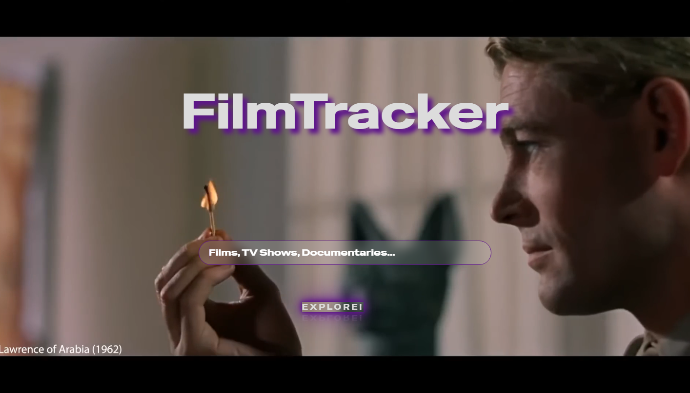
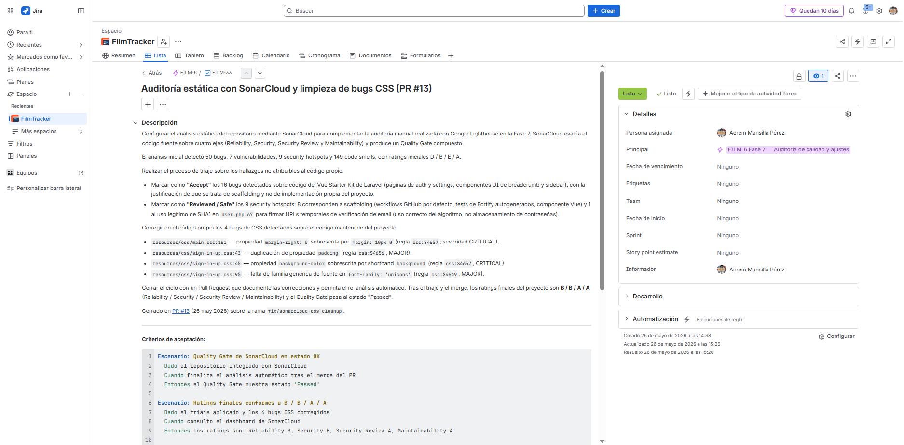
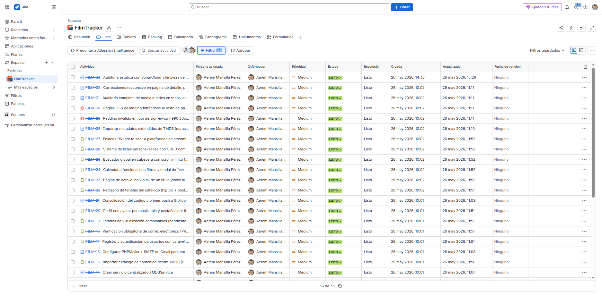
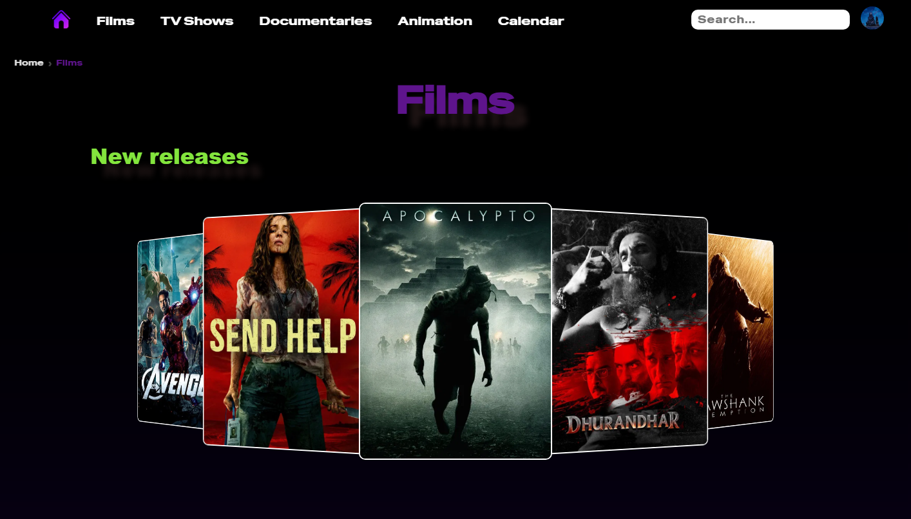
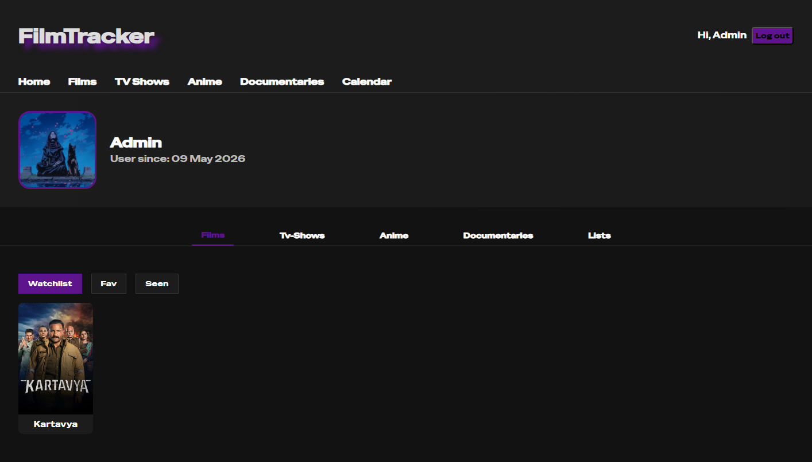

# 🎬 FilmTracker — App web de cine y series

Aplicación web **full-stack** para centralizar el consumo audiovisual disperso entre plataformas: descubrir, buscar, seguir y planificar películas, series, animación y documentales en una sola interfaz. *"All your streaming platforms in one."*

Catálogos importados de la **API de TMDB**, perfil personal (listas, watchlist, vistos, favoritos), calendario de estrenos filtrable, búsqueda global y enlaces directos a plataformas.

Proyecto **individual** de fin de ciclo (2º DAW), asumiendo todos los roles del ciclo de vida del software — incluido el de **QA**.

**Stack:** PHP 8.2 · Laravel 12 · MariaDB · JavaScript · Blade · Vite · API de TMDB · Git/GitHub (Feature Branch + Pull Requests)

## Mi trabajo de QA y calidad

**Accesibilidad — auditoría con Lighthouse.** Media de **94,75/100** en 4 páginas (Landing 100 · Films 90 · Calendar 91 · Detalle 98): HTML semántico, ARIA, contraste WCAG y *focus* visible. Issues residuales documentadas y mejoras futuras declaradas.

**Análisis estático — SonarCloud.** Auditoría de todo el repositorio, **distinguiendo la deuda heredada del starter kit de Laravel de los bugs de mi propio código**: 16 bugs aceptados como deuda heredada, 9 *security hotspots* revisados como *Safe* y 4 bugs propios corregidos. Reliability y Security pasaron de **D/E a B/A**.

**Trazabilidad y gestión — Jira + GitHub.** Reconstruí la trazabilidad del proyecto en **Jira** (tras aprenderlo en las prácticas): **33 incidencias** en épicas, historias, tareas y errores, con **criterios de aceptación en Gherkin** y reportes de bug estructurados (tipo, severidad, análisis de causa raíz, PR que lo resuelve y verificación del fix). Circuito *planificación → código → PR → main* sobre **13 Pull Requests** y **37 commits** firmados.

**Pruebas y robustez.** Pruebas manuales documentadas (PHPUnit/Pest disponibles). Seguridad: hashing bcrypt, protección CSRF, verificación de email firmada y con expiración, y escapado de *wildcards* SQL en el buscador. Mensajes controlados ante fallos de TMDB o del correo.

**Documentación.** Manual de identidad de marca (*Brand Guidelines*) de **24 páginas**, más un README con guía completa de instalación y despliegue.

## La app

🔒 *Repositorio del código privado — acceso bajo petición.*

---
_FilmTracker · © 2026 Aerem · Todos los derechos reservados._
